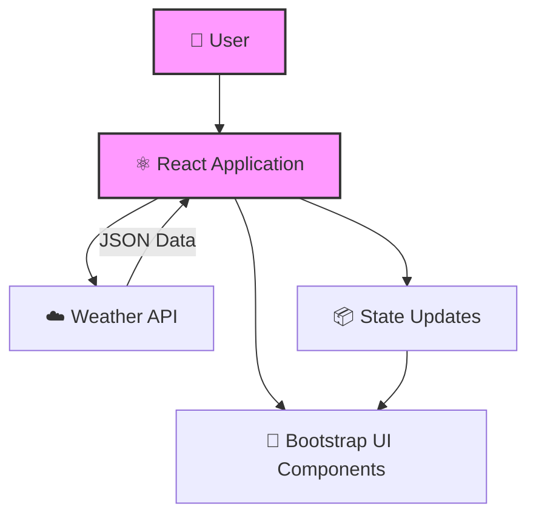

# ☀️ Pogoda 2 - Weather Application

A React-based weather application that fetches and displays meteorological data.

## 🚀 Features

- **Real-Time Weather Data**: Fetches weather information using external APIs.
- **Responsive UI**: Designed with Bootstrap to look great on desktop and mobile devices.
- **React Architecture**: Built with modern React components and state management.

## 🛠 Technology Stack

- **Frontend**: React (v16.13.1), HTML, CSS
- **Styling**: Bootstrap 4
- **Tooling**: Create React App, Webpack, npm/yarn
- **Testing**: React Testing Library

## 🏗 Architecture / Workflow

## ⚙️ Installation / Quick Start

1. Clone the repository: `git clone https://github.com/iv150320/pogoda_2.git`
2. Navigate to the project directory: `cd pogoda_2`
3. Install dependencies: `npm install` (or `yarn install`)
4. Start the development server: `npm start`
5. The application will open in your browser at `http://localhost:3000`.

---
**Author**: @iv150320
